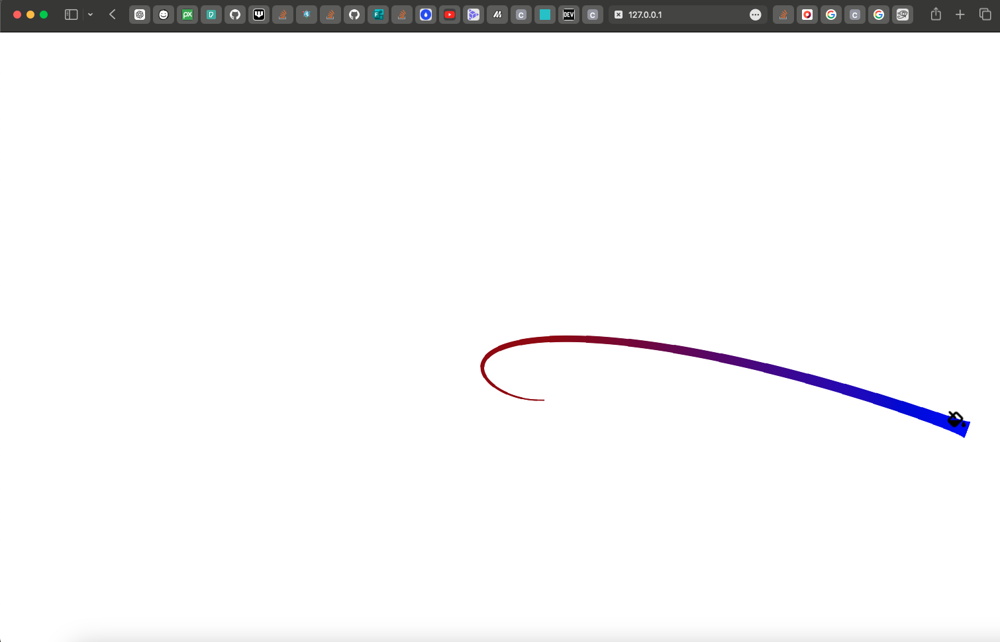

# Draw on Hover Animation Demo

## Features

-> Using Canvas to draw points on hover and connecting them to make a line
-> Adding color to line to make a gradient from start to finish
-> paint bucket for UX

## Code Pen Demo

[demo](https://codepen.io/mattds825/pen/OJeOWMe)

-> Screenshot

## Credits

Simple Draw on Mouse Hover animation from tutorial by [Ksenia Kondrashova](https://dev.to/uuuuuulala/coding-an-interactive-and-damn-satisfying-cursor-7-simple-steps-2kb-of-code-1c8b)

interpolate color function from this [thread](https://stackoverflow.com/questions/66123016/interpolate-between-two-colours-based-on-a-percentage-value)
